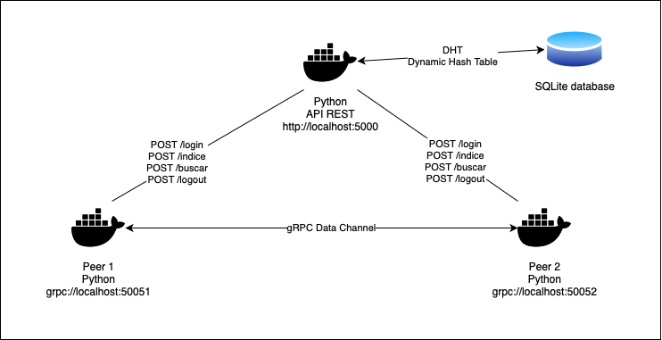

# Arquitectura del Sistema
El sistema está diseñado con una red P2P no estructurada basada en un servidor de Directorio y Localización. Los nodos (peers) pueden conectarse entre sí de manera descentralizada. La arquitectura del sistema incluye los siguientes componentes clave:

1. **Peer Cliente (PCliente):** Encargado de enviar solicitudes para localizar y descargar archivos.
2. **Peer Servidor (PServidor):** Responde las solicitudes de otros peers proporcionando información sobre los archivos almacenados y simula la transferencia de archivos mediante servicios DUMMY.
3. **Servidor API:** Un microservicio que facilita la localización de archivos y recursos en los distintos nodos.

## Diagrama de Arquitectura
El sistema sigue una arquitectura distribuida donde cada peer se comunica con otros peers a través de API REST y gRPC, mientras que el servidor API centraliza la información de localización de recursos.

